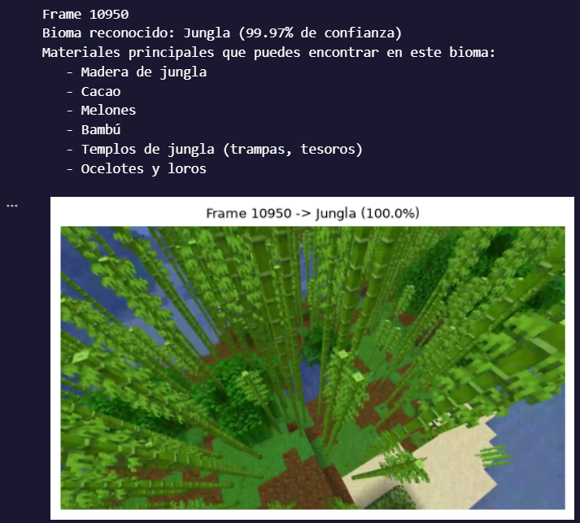

# Clasificación de Biomas de Minecraft con ResNet50

## Descripción del proyecto

Este proyecto implementa un sistema de **clasificación de imágenes y video** capaz de reconocer distintos biomas de Minecraft a partir de una fotografía o de un archivo de video, utilizando **transfer learning** sobre una red **ResNet50** preentrenada en ImageNet.

El proyecto completo abarca:

1. **Descarga y extracción del dataset** de biomas de Minecraft (formato `ImageFolder`, dividido en `train`, `valid` y `test`).
2. **Preprocesamiento de imágenes**: se aplica una máscara HSV para eliminar tonos azules (agua) de las imágenes de entrenamiento, generando una versión `trainProcesado_cutout` que ayuda al modelo a enfocarse en los elementos característicos del terreno en lugar del agua.
3. **Entrenamiento** de un ResNet50 con la capa final (`fc`) reemplazada por un clasificador con `Dropout` + `Linear`, ajustando solo `layer4` y `fc` (fine-tuning parcial) mediante el optimizador Adam.
4. **Evaluación** del modelo con matriz de confusión, `classification_report`, mAP (mean Average Precision) y curvas Precisión-Recall por clase.
5. **Inferencia sobre imágenes o videos**: la función `predecir_bioma()` recibe una foto o un video de Minecraft, identifica el bioma con mayor probabilidad y entrega automáticamente una **lista de materiales recomendados** que se pueden encontrar en ese bioma (madera, minerales, mobs, estructuras, etc.).

### Biomas reconocidos

| Clase | Ejemplos de materiales |
|---|---|
| Bioma-mangle | Raíces de mangle, barro, ranas |
| Bosque-floral | Flores, abejas, miel |
| Bosque-oscuro | Bayas dulces, lobos |
| Bosque-palido | Madera pálida, hongos del bosque pálido |
| Desierto | Arena, cactus, templos del desierto |
| Hongos | Micelio, hongos |
| Jungla | Cacao, bambú, templos de jungla, sandía |
| Meseta | Terracota, oro |
| Mountains | Piedra, hierro, esmeraldas |
| Nieve | Hielo, iglús, osos polares |
| Pantano | Slime, cabañas de brujas, arcilla |
| Sabana | Madera de acacia, llamas |

### Funcionalidad clave: reconocimiento en imagen o video

La función `predecir_bioma(ruta_archivo)`:

- Detecta automáticamente si el archivo es una **imagen** (`.jpg`, `.jpeg`, `.png`, `.bmp`) o un **video** (`.mp4`, `.avi`, `.mov`, `.mkv`).
- Para video, samplea frames a intervalos regulares (`frame_skip`) hasta un máximo (`max_frames`)
- Muestra el bioma reconocido, el porcentaje de confianza, y finalmente **recomienda los materiales principales** disponibles en ese bioma.

---

## Librerías necesarias

Instalar con `pip`:

```bash
pip install torch torchvision torchaudio --index-url https://download.pytorch.org/whl/cu118
pip install opencv-python
pip install numpy matplotlib pillow scikit-learn seaborn
pip install gdown
```

Resumen de librerías utilizadas en el proyecto:

| Librería | Uso |
|---|---|
| `torch`, `torchvision` | Modelo ResNet50, datasets (`ImageFolder`), transformaciones, entrenamiento e inferencia |
| `opencv-python` (`cv2`) | Preprocesamiento HSV (cutout de agua) y lectura de frames de video |
| `numpy` | Operaciones numéricas y promedios de probabilidades |
| `matplotlib` | Visualización de imágenes, gráficos de distribución de clases y curvas Precisión-Recall |
| `Pillow` (`PIL`) | Carga y conversión de imágenes |
| `scikit-learn` | Métricas: matriz de confusión, `classification_report`, mAP, curvas PR |
| `seaborn` | Visualización de la matriz de confusión |
| `gdown` | Descarga del dataset desde Google Drive |

> **Nota:** se recomienda usar un entorno con GPU (CUDA) para acelerar el entrenamiento. El notebook detecta automáticamente si hay GPU disponible (`torch.cuda.is_available()`).

---

# Cómo usarlo

## Crear entorno virtual con `venv` (Python nativo)

```bash
# Crear el entorno
python -m venv venv

# Activar en Windows
venv\Scripts\activate

# Activar en Linux/Mac
source venv/bin/activate

# Instalar dependencias
pip install torch torchvision torchaudio --index-url https://download.pytorch.org/whl/cu118
pip install opencv-python numpy matplotlib pillow scikit-learn seaborn gdown
```

```python
# Cargar el modelo ya entrenado
model.load_state_dict(torch.load("resnet50_best.pt", map_location=device))
model.eval()

# Predecir sobre una imagen
predecir_bioma("ruta_imagen.jpg")

# Predecir sobre un video
predecir_bioma("ruta_video.mp4", frame_skip=150, max_frames=400, mostrar_frames=True)

```

---

## Ejemplo de inferencia

A continuación se muestra un ejemplo real de salida del modelo al procesar una imagen del bioma **Jungla**:



---

## Estructura del proyecto

```
Clasificacion-Biomas-Minecraft/
├── Dataset-Minecraft/
│   └── Clasificacion Biomas Minecraft.folder.zip
├── train/
├── trainProcesado_cutout/
├── valid/
├── test/
├── clasificacionResNet50.ipynb
├── resnet50_best.pt
├── README.dataset.txt
├── README.roboflow.txt
└── README.md
```